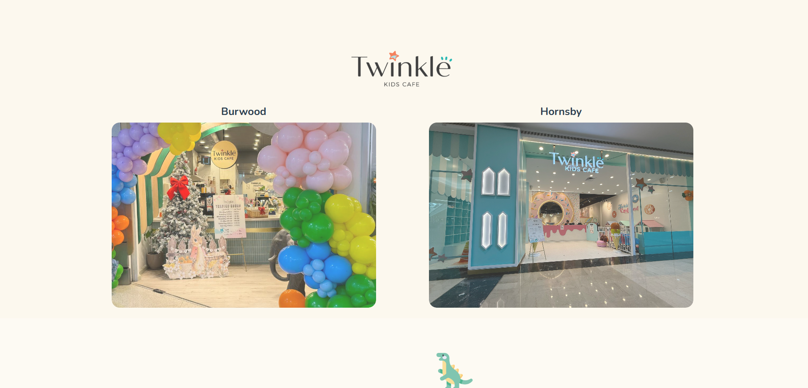
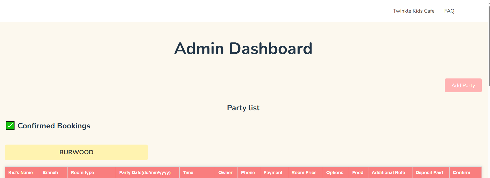

# kids-cafe
Kids cafe party booking system 

# 🎉 Twinkle Kids Cafe - Party Booking Website

A full-stack web application for managing birthday party reservations at Twinkle Kids Cafe, supporting both *Burwood* and *Hornsby* branches.

> 📱 Fully responsive | 🛠️ Vue + Go + Firebase | 🎈 Admin Dashboard included

---

## 🖼️ Preview

### Main Page  (Branch Selection Flow on Landing Page)


### Admin Dashboard  


---

## 🚀 Features

- 📍 Branch-aware booking system (Burwood / Hornsby)
- 📅 Date & time selection with custom time slots per room type
- 🧒 Child info, room, food, allergy, and additional options
- 🎈 Optional balloon decoration themes
- ✅ Admin-only party confirmation dashboard
- 📱 Mobile-first responsive design
- 🔗 Instagram link & branch-specific opening hours

---

## 🛠️ Tech Stack

| Layer      | Technology                |
|------------|---------------------------|
| Frontend   | Vue.js 3, HTML, CSS       |
| Backend    | Go (Golang), Gin framework|
| Database   | Firebase (Cloud Firestore)|
| Hosting    | Firebase Hosting (Frontend)<br>Render (Go Backend) |

---

## 🌐 Live Website

> 🔗 [twinklekidscafe.web.app](https://kids-cafe-booking-project.web.app/)

---

## ⚙️ How to Run Locally

### 🔧 Frontend

```bash
cd frontend\kids-cafe
npm install
npm run dev
